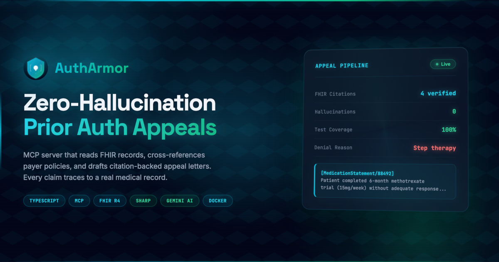

<div align="center">
  
  <h1>🛡️ AuthArmor</h1>
  <p><em>AI agents that fight denied prior authorizations — so clinicians don't have to.</em></p>

  [](https://autharmor-mcp.fly.dev/health)
  [](https://youtube.com/)
  <br/>
  [](https://github.com/edycutjong/autharmor/actions/workflows/ci.yml)
  [](https://github.com/edycutjong/autharmor)
  [](LICENSE)
  [](https://nodejs.org)
</div>

---

## 📸 See It in Action

> An AI agent reads a patient's FHIR record, finds the denial, and generates a citation-backed appeal letter — in one conversation.

<!-- Replace with actual demo GIF/screenshot -->
<!--  -->

```
Clinician: "Check the prior auth status for adalimumab"
   → Agent reads FHIR MedicationRequest + ClaimResponse
   → Returns: Denied — reason: "step therapy requirement not met"

Clinician: "Generate an appeal letter"
   → Agent pulls patient labs, diagnoses, medication history from FHIR
   → Gemini AI drafts appeal with inline citations to specific FHIR data
   → Returns formatted appeal letter ready for submission
```

---

## 💡 The Problem & Solution

**Every year, U.S. physicians spend 34 hours/week on prior authorizations** — time stolen from patient care. When a prior auth is denied, clinicians must manually dig through patient records, find supporting evidence, and draft appeal letters. Most give up.

**AuthArmor** is an MCP server that gives AI healthcare agents the power to:

- ⚡ **Read patient FHIR records** — pull diagnoses, labs, medications, and denial reasons automatically
- 📋 **Generate citation-driven appeals** — every claim backed by specific FHIR data references, not hallucinations
- 📄 **Export appeal documents** — formatted and ready for payer submission

> **Capability unlock:** AI healthcare agents could already *read* patient data. AuthArmor lets them **fight back** against denials — a capability that literally didn't exist before.

---

## 🏗️ Architecture & Tech Stack

```
┌─────────────────────────────────────────────────┐
│              Prompt Opinion Platform            │
│         (AI Agent + Patient Context)            │
└──────────────────┬──────────────────────────────┘
                   │ POST /mcp
                   │ + SHARP headers (x-fhir-server-url,
                   │   x-fhir-access-token, x-patient-id)
                   ▼
┌─────────────────────────────────────────────────┐
│           AuthArmor MCP Server                  │
│           (Express 5 + Streamable HTTP)         │
│                                                 │
│  ┌──────────────┐  ┌────────────────────────┐   │
│  │ CheckAuth    │  │  GenerateAppeal        │   │
│  │ StatusTool   │  │  Tool                  │   │
│  │              │  │                        │   │
│  │ Reads FHIR   │  │ FHIR data + Gemini AI  │   │
│  │ records for  │  │ → citation-driven      │   │
│  │ denial info  │  │   appeal letter        │   │
│  └──────┬───────┘  └───────┬────────────────┘   │
│         │                  │                    │
│  ┌──────▼──────────────────▼────────────────┐   │
│  │         GetAppealPdf Tool                │   │
│  │    (Export formatted appeal document)    │   │
│  └──────────────────────────────────────────┘   │
└──────────┬────────────────────┬─────────────────┘
           │                    │
           ▼                    ▼
    ┌──────────────┐    ┌──────────────┐
    │  FHIR Server │    │  Gemini AI   │
    │  (Workspace) │    │  (Google)    │
    └──────────────┘    └──────────────┘
```

| Layer | Technology |
|---|---|
| **Runtime** | Node.js 22+, TypeScript |
| **Server** | Express 5, MCP SDK (`@modelcontextprotocol/sdk`) |
| **FHIR** | `@smile-cdr/fhirts`, Axios |
| **AI** | Google Gemini (`@google/genai`) |
| **Auth** | JOSE (JWT/JWKS), SHARP-on-MCP headers |
| **Validation** | Zod v4 |
| **Testing** | Jest, 100% coverage |
| **Deployment** | Fly.io (SJC region), Docker |
| **CI/CD** | GitHub Actions |

---

## 🏆 Hackathon Track

Built for **[Agents Assemble — The Healthcare AI Endgame](https://agents-assemble.devpost.com/)** → **Track 1: MCP Superpower**

### Sponsor Integration

| Sponsor Tech | How We Used It | Code Location |
|---|---|---|
| **SHARP-on-MCP** | Receives FHIR context via HTTP headers (`x-fhir-server-url`, `x-fhir-access-token`, `x-patient-id`) | [`src/lib/fhir-context.ts`](src/lib/fhir-context.ts), [`src/index.ts`](src/index.ts) |
| **MCP SDK** | Full Streamable HTTP transport with tool registration | [`src/index.ts`](src/index.ts) |
| **Prompt Opinion** | Deployed & registered as external MCP server | [Live endpoint](https://autharmor-mcp.fly.dev/mcp) |
| **FHIR R4** | Reads MedicationRequest, ClaimResponse, Condition, Observation | [`src/lib/fhir-client.ts`](src/lib/fhir-client.ts) |
| **Google Gemini** | Generates citation-driven appeal letters with FHIR data grounding | [`src/lib/gemini-client.ts`](src/lib/gemini-client.ts) |

---

## 🔧 MCP Tools

| Tool | Input | Output |
|---|---|---|
| `CheckAuthStatus` | `medication` (string) | Denial details: reason, date, payer, medication info — all from FHIR |
| `GenerateAppeal` | `medication`, `denial_reason` | Full appeal letter with inline FHIR citations (labs, diagnoses, history) |
| `GetAppealPdf` | `appeal_text` | Formatted document text ready for export/download |

---

## 🚀 Run It Locally (For Judges)

### Prerequisites
- Node.js 22+
- [Gemini API key](https://aistudio.google.com/apikey) (free tier works)
- [ngrok](https://ngrok.com/) account (free)

### Setup
```bash
# 1. Clone
git clone https://github.com/edycutjong/autharmor.git
cd autharmor

# 2. Install
npm install

# 3. Configure environment
cp .env.example .env
# Edit .env → add your GEMINI_API_KEY

# 4. Start the server
npm run start
# → Server running at http://localhost:3050/mcp

# 5. Run the automated golden-path demo
npm run demo
```

### Connect to Prompt Opinion
```bash
# 1. Expose your server via ngrok
ngrok http 3050
```

2. In Prompt Opinion → **Workspace Hub** → **Add MCP Server**
3. Paste `{ngrok_url}/mcp` → check **"Streamable HTTP"** → check **"FHIR context"**
4. Click **Test** → verify 3 tools appear → **Save**

### Test Prompts

Select a patient (e.g., Morgan564 Larson43), then try:

```
1. "Check the prior auth status for adalimumab"
2. "Generate an appeal letter for adalimumab — it was denied for step therapy requirement not met"
3. "Format this as an appeal document"
```

---

## ☁️ Live Deployment

AuthArmor is **deployed and live** on Fly.io:

| Endpoint | URL | Status |
|---|---|---|
| Health Check | [`autharmor-mcp.fly.dev/health`](https://autharmor-mcp.fly.dev/health) | ✅ Live |
| MCP Server | [`autharmor-mcp.fly.dev/mcp`](https://autharmor-mcp.fly.dev/mcp) | ✅ Live |

---

## ✅ Concrete Proof

| Signal | Evidence |
|---|---|
| **Live deployed URL** | [autharmor-mcp.fly.dev](https://autharmor-mcp.fly.dev/health) |
| **CI/CD pipeline** | [GitHub Actions](https://github.com/edycutjong/autharmor/actions/workflows/ci.yml) — passing |
| **100% test coverage** | Jest with full branch coverage |
| **Golden-path demo** | `npm run demo` — automated end-to-end verification |
| **3 real FHIR patient bundles** | `data/` — RA, MS, T2D scenarios with realistic clinical data |
| **Payer policy grounding** | `data/payer-policy-humira.md` — real formulary criteria |

---

## 📁 Project Structure

```
autharmor/
├── src/
│   ├── index.ts              # Express 5 + MCP server bootstrap
│   ├── tools/
│   │   ├── CheckAuthStatusTool.ts   # FHIR record reader
│   │   ├── GenerateAppealTool.ts    # Gemini-powered appeal generator
│   │   └── GetAppealPdfTool.ts      # Document formatter
│   ├── lib/
│   │   ├── fhir-client.ts    # FHIR API client (Axios)
│   │   ├── fhir-context.ts   # SHARP header extraction
│   │   ├── fhir-utilities.ts # FHIR resource helpers
│   │   ├── gemini-client.ts  # Google Gemini integration
│   │   └── mcp-*.ts          # MCP constants & utilities
│   └── types/                # TypeScript type definitions
├── data/                     # FHIR patient bundles + payer policies
├── scripts/
│   └── golden-path.ts        # Automated demo script
├── docs/
│   ├── icon.svg              # App logo
│   └── assets/               # OG image, thumbnail generators
├── .env.example              # Environment variable template
├── .github/workflows/        # CI pipeline
├── Dockerfile                # Container image
├── fly.toml                  # Fly.io deployment config
└── jest.config.ts            # Test configuration (100% coverage)
```

---

## 🔐 SHARP-on-MCP Context

AuthArmor receives FHIR context securely via [SHARP](https://www.sharponmcp.com/) HTTP headers:

| Header | Purpose |
|---|---|
| `x-fhir-server-url` | FHIR server base URL (workspace-provided) |
| `x-fhir-access-token` | Bearer token for FHIR API calls |
| `x-patient-id` | Patient ID (fallback if not in FHIR context) |

---

## 📄 License

MIT — see [LICENSE](LICENSE) for details.

---

<div align="center">
  <sub>Built with ❤️ for <a href="https://agents-assemble.devpost.com/">Agents Assemble — The Healthcare AI Endgame</a></sub>
  <br>
  <sub>Thank you for your time reviewing this project.</sub>
</div>
